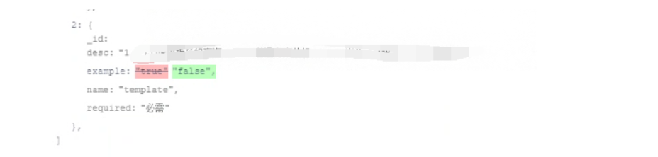
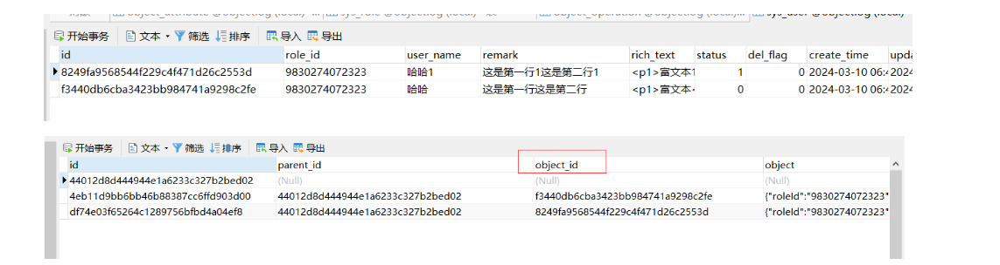
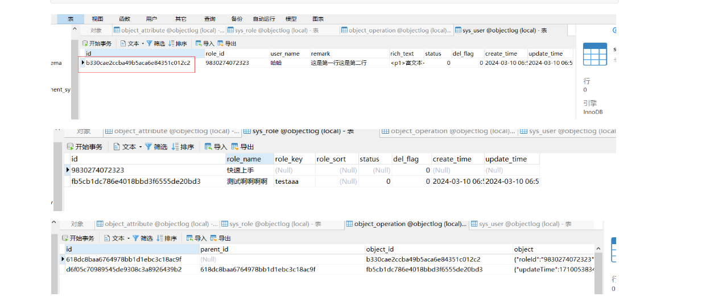
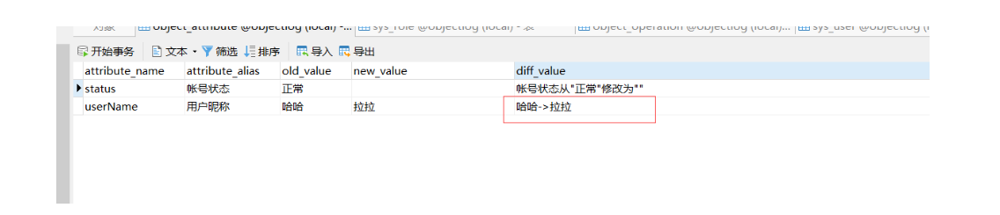
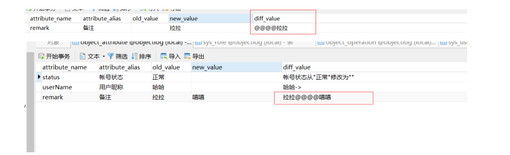
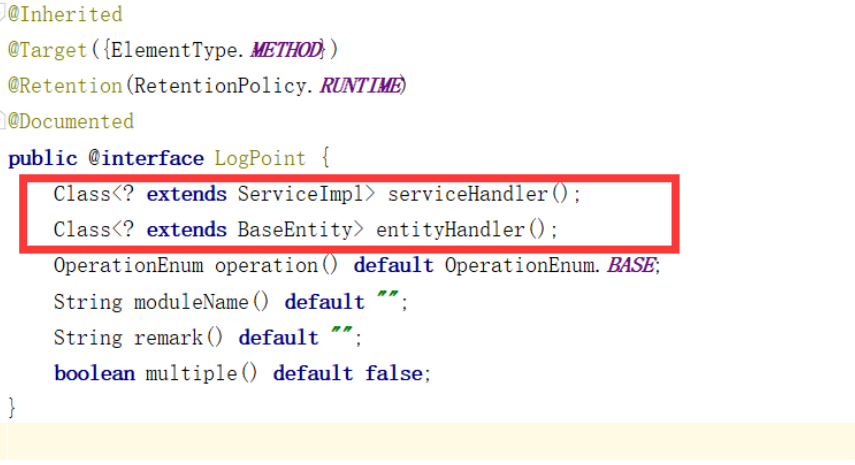

## objectlog


### 工具优势

 （持续更新）对于重要的一些数据，我们需要`记录一条记录的所有版本变化过程`，做到持续追踪，为后续问题追踪提供思路。`objectlog工具`是一个记录单个对象属性变化的日志工具,工具`采用spring切面和mybatis拦截器`相关技术`编写了api依赖包`，以`非侵入方式`实现对标记的对象属性`进行记录`，`仅需要导入依赖即可，几乎不需要对原系统代码改动`，下面展示简单的效果(根据对象field渲染即可)：



该系统具有以下特点：

- 简单易用：系统将核心逻辑抽离，采用非侵入方式，只需要导入依赖后标注相关注解即可。
- 业务共享：系统可以同时供多个业务系统使用，彼此之间互不影响。
- 自动解析：能自动解析对象的属性变化，自动生成变化记录。
- 便于扩展：支持更多对象属性类型的扩展，支持自定义解析处理逻辑等。
- 工具性能：工具采用线程模式，脱离业务主线程，避免了解析过程对业务性能的影响。


### 工具介绍

工具主要为分为core,domain,feign三个包。位于objectlog-api下，其中`core包是核心内容，另外一个包根据自身业务可以进行删除和变更`。

- `core包`：核心逻辑的实现，包含类型处理器类和值处理器类等。
- `domain包`：自身业务的基类BaseEntity(核心是主键id字段，其他字段可有可无)，自动填充字段逻辑BaseMetaObjectHandler和操作记录查询封装类ObjectOperationDto。

> 注意在仓库中objectlog-api-test中则为本次的演示代码。
> + BASE :  单个的对象记录(包含增删改)，不存在子对象的记录
> + COMMENT： 一组对象的记录(包含增删改)，不存在父子关系，如批量导入
> + COMPLEX：单个对象的记录(包含增删改)，存在子对象的记录


### 快速上手

#### 基础操作

使用过程主要分为两步骤：

+ 标记需要解析的类对象和字段
+ 标记切入点

第一步：我们对需要记录的类对象使用`@LogEntity`进行标注，其中放在类上表示开启解析标记，否则不进行记录。与此同时，对于未标记的属性也不进行记录。

~~~java
@LogEntity
public class SysUserModel extends BaseEntity {
    //关联主键字段
    @LogEntity(alias = "角色信息", associationValue = true, serviceImplClass = SysRoleServiceImpl.class, entityFieldName = "roleName")
    private String roleId;
    
    //基础字段
    @LogEntity(alias = "用户昵称")
    private String userName;
    
    //多行文本串
    @LogEntity(alias = "备注" ,attributeTypeEnum = AttributeTypeEnum.TEXT)
    private String remark;
    
    //富文本字段
    @LogEntity(alias = "富文本内容" , attributeTypeEnum = AttributeTypeEnum.RICHTEXT)
    private String richText;
    
    //枚举字段
    @LogEntity(alias = "帐号状态",enumValue = true, enumClass = StatusEnum.class)
    private Integer status;
}


~~~

~~~java
public enum StatusEnum {
    NORMAL(0,"正常"),
    DEACTIVATE(1,"停用"),;
}
~~~


第二步：我们我们标记切入点

~~~java
    @LogPoint( serviceHandler = SysUserServiceImpl.class, entityHandler = SysUserModel.class,
            moduleName = "sysUser",  remark = "测试用户模块")
    public void add(SysUserModel insertModel) {
        this.insert(insertModel);
    }
~~~

以下是当前对象的属性（当前操作是新增）：

~~~java
    @GetMapping(value = "/add")
    @ResponseBody
    public void testAdd(){
        SysUserModel userModel = new SysUserModel();
        userModel.setRoleId("9830274072323");
        userModel.setUserName("哈哈");
        userModel.setRemark("这是第一行\n" + "这是第二行");
        userModel.setStatus(0);
        userModel.setRichText("<p1>富文本<p1>");
        userService.add(userModel);
        //查看数据库
    }
~~~

其中roleId在数据库中存在一条记录:

> INSERT INTO `objectlog`.`sys_role` (`id`, `role_name`, `role_key`, `role_sort`, `status`, `del_flag`, `create_time`, `update_time`) VALUES ('9830274072323', '快速上手', NULL, NULL, NULL, 0, NULL, NULL);

执行结果如下所示，其中`diffValue`属性表示前后对比变化，可以看到`枚举字段和关联主键字段自动进行了转化`。`富文本字段，多行文本串被详细区分为行信息`。

> attributes：表示这个对象具体属性的变化记录
>
> operationId：属性变化源自的操作id。

~~~json
{
    "96c2b007f9854b3aa73046d317fb7b6d": [
        {
            "id": "ebe6de00ddc84c8baf6881587e144d64",
            "createTime": "2024-03-10T14:07:30",
            "updateTime": "2024-03-10T14:07:30",
            "delFlag": 0,
            "parentId": null,
            "moduleName": "sysUser",
            "objectName": "SysUserModel",
            "objectId": "96c2b007f9854b3aa73046d317fb7b6d",
            "object": "{\"roleId\":\"9830274072323\",\"remark\":\"这是第一行\\n这是第二行\",\"updateTime\":1710050850367,\"userName\":\"哈哈\",\"richText\":\"<p1>富文本<p1>\",\"createTime\":1710050850367,\"id\":\"96c2b007f9854b3aa73046d317fb7b6d\",\"status\":0}",
            "operationType": "ADD",
            "version": 1,
            "comment": "测试用户模块",
            "attributes": [
                {
                    "operationId": "ebe6de00ddc84c8baf6881587e144d64",
                    "attributeType": "NORMAL",
                    "attributeName": "status",
                    "attributeAlias": "帐号状态",
                    "oldValue": "",
                    "newValue": "正常",
                    "diffValue": "帐号状态从\"\"修改为\"正常\""
                },
                {
                    "operationId": "ebe6de00ddc84c8baf6881587e144d64",
                    "attributeType": "NORMAL",
                    "attributeName": "userName",
                    "attributeAlias": "用户昵称",
                    "oldValue": "",
                    "newValue": "哈哈",
                    "diffValue": "用户昵称从\"\"修改为\"哈哈\""
                },
                {
                    "operationId": "ebe6de00ddc84c8baf6881587e144d64",
                    "attributeType": "NORMAL",
                    "attributeName": "roleId",
                    "attributeAlias": "角色信息",
                    "oldValue": "",
                    "newValue": "9830274072323",
                    "diffValue": "角色信息从\"\" 修改为 \"快速上手\""
                },
                {
                    "operationId": "ebe6de00ddc84c8baf6881587e144d64",
                    "attributeType": "TEXT",
                    "attributeName": "remark",
                    "attributeAlias": "备注",
                    "oldValue": "",
                    "newValue": "这是第一行\n这是第二行",
                    "diffValue": "{\"version\":\"1.0.0\",\"content\":[{\"lineNumber\":1,\"partList\":[{\"partContent\":\"这是第一行\",\"partType\":\"CHANGE_NEW\"},{\"partContent\":\"这是第二行\",\"partType\":\"CHANGE_NEW\"}]}]}"
                },
                {
                    "operationId": "ebe6de00ddc84c8baf6881587e144d64",
                    "attributeType": "RICHTEXT",
                    "attributeName": "richText",
                    "attributeAlias": "富文本内容",
                    "oldValue": "",
                    "newValue": "<p1>富文本<p1>",
                    "diffValue": "{\"version\":\"1.0.0\",\"content\":[{\"lineNumber\":1,\"partList\":[{\"partContent\":\"富文本\",\"partType\":\"CHANGE_NEW\"}]}]}"
                }
            ],
        }
    ]
}
~~~


#### 父级联合

上面我们展示了简单的对象记录过程，可以看见使用非常的方便和快捷。但针对以下些业务场景，却显得有所乏力，为此我们引入了一个新的概念父操作。

>+ 情景一：对于批量导入，除了记录某一个对象a本身的变化过程，我们还需要可以直观了解这个对象a创建的源头，在源头记录中(也就是批量导入这一操作)，我们可以获取源头操作所有操作内容(包含了对象a的记录变更，也包含其他对象的记录变更)，实现不同对象的联动。
>+ 情景二：对于单个对象a，一次变更操作过程中，若存在关联表字段b对象的修改，需要自动将b对象的变更记录和对象a操作记录绑定（当然对象a本身也会产生操作记录）


我们还是以前面需要记录的对象为例，对这两种场景进行介绍和说明：

**情景一**：

~~~java
    @GetMapping(value = "/addlist")
    @ResponseBody
    public void testAddList(){
        List<SysUserModel> insertList = new ArrayList<>();
        SysUserModel userModel = new SysUserModel();
        userModel.setRoleId("9830274072323");
        userModel.setUserName("哈哈");
        userModel.setRemark("这是第一行\n" + "这是第二行");
        userModel.setStatus(0);
        userModel.setRichText("<p1>富文本<p1>");
     
        SysUserModel userMode2 = new SysUserModel();
        userMode2.setRoleId("9830274072323");
        userMode2.setUserName("哈哈1");
        userMode2.setRemark("这是第一行1\n" + "这是第二行1");
        userMode2.setStatus(1);
        userMode2.setRichText("<p1>富文本1<p1>");
        insertList.add(userModel);
        insertList.add(userMode2);
        userService.addList(insertList);
        //查看数据库
    }
~~~

~~~java
    @LogPoint( serviceHandler = SysUserServiceImpl.class, entityHandler = SysUserModel.class,
            operation = OperationEnum.COMMON, moduleName = "sysUser",  remark = "测试用户模块")
    public void addList(List<SysUserModel> insertModelList) {
        this.insertBatch(insertModelList);
    }
~~~

相关结果如下所示，可以看见批量导入的两个对象的操作记录id都被挂载在一个父操作记录id=44012d8d444944e1a6233c327b2bed02下.





（注：图二操作记录表）

**情景二**：

~~~java
@LogEntity
public class SysUserModel extends BaseEntity {
	//.... 部分属性忽略
    //子对象model
    @TableField(exist = false)
    private SysRoleModel roleModel;
}

~~~


~~~java
    @GetMapping(value = "/addassociate")
    @ResponseBody
    public void addassociate(){
        //用户
        SysUserModel userModel = new SysUserModel();
        userModel.setRoleId("9830274072323");
        userModel.setUserName("哈哈");
        userModel.setRemark("这是第一行\n" + "这是第二行");
        userModel.setStatus(0);
        userModel.setRichText("<p1>富文本<p1>");

        //角色
        SysRoleModel roleModel = new SysRoleModel();
        roleModel.setRoleName("测试啊啊啊啊");
        roleModel.setRoleKey("testaaa");
        roleModel.setStatus(0);

        //关联
        userModel.setRoleModel(roleModel);

        userService.addassociate(userModel);
        //查看数据库
    }
~~~


~~~java
    @Override
    @LogPoint( serviceHandler = SysUserServiceImpl.class, entityHandler = SysUserModel.class,
            operation = OperationEnum.COMPLEX, moduleName = "sysUser",  remark = "测试用户模块")
    public void addassociate(SysUserModel userModel) {
        this.insert(userModel);
        roleService.insert(userModel.getRoleModel());
    }
~~~


（注：图三操作记录表）


### 工具扩展

在核心包中有一个handler包，下面提供字段如何字段转换和解析。在包中提供了基础类型(`NORMAL`，`RICHTEXT`，`TEXT`）的类型处理器和值处理器，他们分别实现了`AttributeTypeHandler`，`AttributeValueHandler`中的方法。当默认逻辑不符合我们需求时，我们通过重写逻辑实现不一样的效果，下面我们进行相关介绍。

#### 值处理器

在属性记录字段`diffvalue中`，我们`注意到记录变化格式通常是xxx从xx修改为xx`，现在我们将其格式进行变化：（当然你也可以直接改动objectlog-api中的格式，但是不一定满足所有的需求，那么就可以通过这种方式来实现自定义）。

> INSERT INTO `objectlog`.`sys_user` (`id`, `role_id`, `user_name`, `remark`, `rich_text`, `status`, `del_flag`, `create_time`, `update_time`) VALUES ('8ad4497100ea480f841b2f645f3c512c', NULL, '哈哈', NULL, NULL, 0, 0, '2024-03-10 07:14:57', '2024-03-10 07:14:57');

~~~java
@LogEntity
public class SysUserModel extends BaseEntity {
    @LogEntity(alias = "用户昵称",extendedValue = true, attributeValueHandler = CustomerValueHandler.class)
    private String userName;
}
~~~

~~~java
public class CustomerValueHandler implements AttributeValueHandler {
    //新的对比方式
    @Override
    public String handlerValue(ObjectFieldWrapper objectFieldWrapper) {
        return objectFieldWrapper.getOldValueString() + "->" + objectFieldWrapper.getNewValueString();
    }
}
~~~





#### 类型处理器

~~~java
@LogEntity
public class SysUserModel extends BaseEntity {
    @LogEntity(alias = "备注" ,extendedType = "TYPE_HANDLER", attributeTypeHandler = CustomerTypeHandler.class)
    private String remark;
}
~~~

~~~java
    @GetMapping(value = "/typehandler")
    @ResponseBody
    public void testTypeHandler(){
        SysUserModel userModel = new SysUserModel();
        userModel.setId("8ad4497100ea480f841b2f645f3c512c");
        userModel.setRemark("嘻嘻");
        userService.add(userModel);
        //查看数据库
    }
~~~

~~~java
public class CustomerTypeHandler implements AttributeTypeHandler {
    @Override
    public ObjectAttributeModel handlerAttributeChange(ObjectFieldWrapper fieldWrapper) {
        return this.dealAttributeModel(fieldWrapper);
    }
    public ObjectAttributeModel dealAttributeModel(ObjectFieldWrapper fieldWrapper) {
        ObjectAttributeModel attributeModel = this.getAttribute(fieldWrapper);
        //根据需要判断是否生成
        if (null != attributeModel) {
            dealBaseInfo(fieldWrapper, attributeModel, fieldWrapper.getExtendedType());
            attributeModel.setDiffValue(this.dealDiffValue(fieldWrapper.getOldValueString(), fieldWrapper.getNewValueString()));
        }
        return attributeModel;
    }

    public String dealDiffValue(String oldValue, String newValue) {
        return oldValue + "@@@@" + newValue;
    }

    public ObjectAttributeModel getAttribute(ObjectFieldWrapper fieldWrapper) {
        return new ObjectAttributeModel();
    }
    public static void dealBaseInfo(ObjectFieldWrapper fieldWrapper, ObjectAttributeModel attributeModel, String attributeType) {
        //固定值
        attributeModel.setOldValue(fieldWrapper.getOldValueString());
        attributeModel.setNewValue(fieldWrapper.getNewValueString());
        attributeModel.setAttributeName (fieldWrapper.getAttributeName());
        attributeModel.setAttributeAlias(fieldWrapper.getAttributeAlias());
        attributeModel.setAttributeType(attributeType);
    }
}
~~~




注：建议继承BaseAttributeTypeHandler实现重写逻辑。


### 引入项目

> 系统现在默认将日志记录api作为依赖`集成到某个具体的业务模块中`，当然`也可以直接将日志做为一个新的服务`，`下面我们按集成到某个具体的业务模块中进行介绍`。

+ **改变基类对象**，目前主流的mybatis-plug提供了自带curd操作类`ServiceImpl`,`IService`,`BaseMapper`，在`@LogPoint`中ServiceImpl切换自身业务系统基于`ServiceImpl`进一步封装类，其次是 `BaseEntity.class`(核心是主键id字段，其他字段可有可无)，这个是你自身业务系统的基类。
  


+ **导入表**，`objectlog-api-test`模块下的 `object_attribute.sql` 和`object_operation.sql`导入到业务模块中


+ **配置服务地址**，在引入的依赖服务中配置一下信息

```yml
object-log:
  host: http://127.0.0.1:8888 #服务地址
  path: /objectlog/add #存储接口
  header: #转发需要携带的请求头信息，主要避免转发时认证信息丢失导致不成功
    - Authorization
```

+ **业务服务补充保存接口**，以演示代码为例：

```java
@RestController
@RequestMapping(value = "/objectlog")
public class ObjectOperationController {
    @Resource
    private ObjectOperationService operationService;
    @PostMapping("/add")
    public void addLog(@RequestBody ObjectOperationDto model) {
        //TODO 保存逻辑  
    }
}
```


